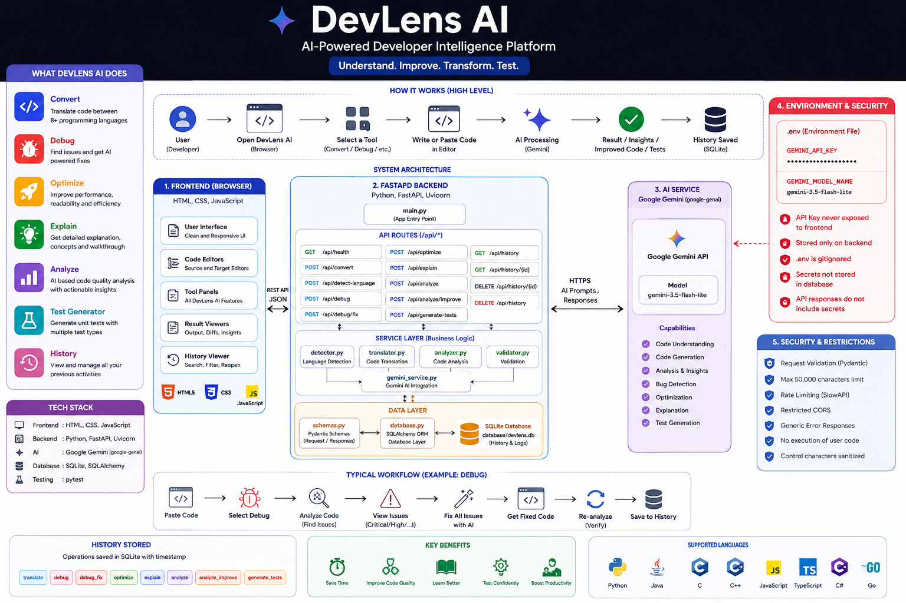
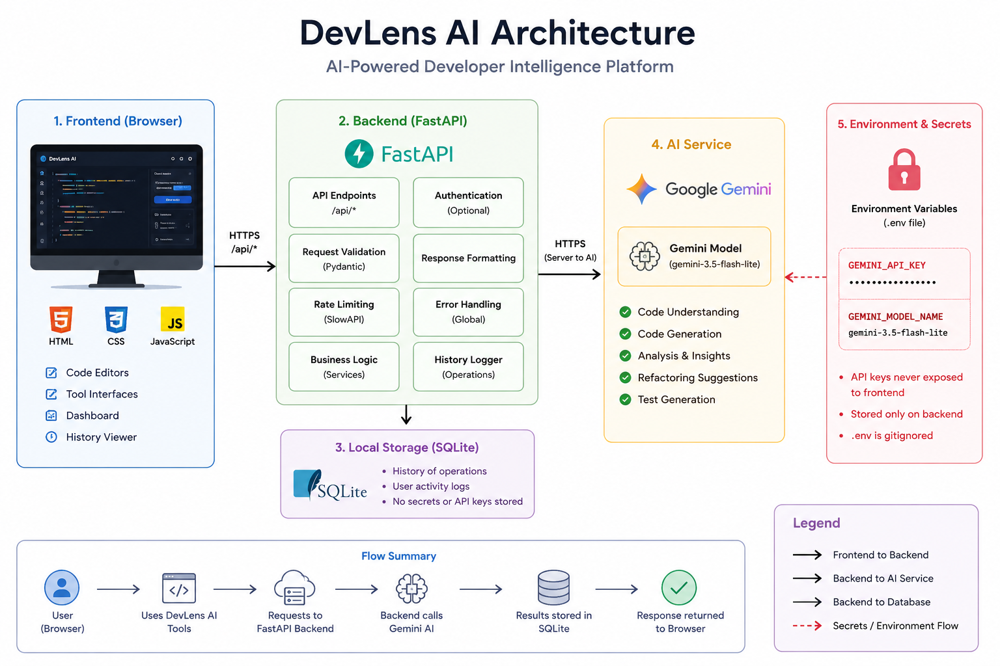

# DevLens AI

**AI-Powered Developer Intelligence Platform**

*Understand. Improve. Transform. Test.*



DevLens AI helps developers convert, debug, optimize, explain, analyze, and generate tests for source code. The browser UI talks only to a FastAPI backend. The backend is the only component that calls Google Gemini. The Gemini API key never leaves the server.

## Features

- **Convert** — translate between Python, Java, C, C++, JavaScript, TypeScript, C#, and Go
- **Debug** — structured issue reports (critical / high / medium / low) plus **Fix All Issues with AI** and re-analysis
- **Optimize** — categorized changes with honest before/after complexity (no Big-O claims unless it changed)
- **Explain** — overview, details, walkthrough, concepts, and edge cases
- **Analyze** — AI dimensional scores with a **deterministic weighted overall score**, plus **Improve Code with AI** and a real second analysis
- **Test Generator** — framework-aware tests classified as normal, edge, exception, security, and regression
- **Dashboard & History** — launch tools, review recent activity, reopen prior source in the matching editor

## Architecture



History is stored in a local SQLite database (`database/devlens.db`). A legacy `codeforge.db` file in the same directory is also accepted for backward compatibility.

## Tech stack

| Layer | Technology |
| --- | --- |
| Frontend | HTML, CSS, JavaScript (no Streamlit) |
| Backend | Python, FastAPI, Uvicorn |
| AI | Google Gemini (`google-genai`) |
| Database | SQLite via SQLAlchemy |
| Tests | pytest |

## Installation

```powershell
cd path\to\DevLens-AI
python -m venv .venv
.\.venv\Scripts\Activate.ps1
pip install -r requirements.txt
```

## Environment variables

Copy `.env.example` to `.env` and set:

```
GEMINI_API_KEY=your_gemini_api_key_here
GEMINI_MODEL_NAME=gemini-3.5-flash-lite
```

Optional:

```
DEVLENS_DB_PATH=C:\path\to\custom.db
```

Get a Gemini key from [Google AI Studio](https://aistudio.google.com/apikey). Do not commit `.env`.

## Running the backend and frontend

The FastAPI app serves the UI from `/` and static assets from `/static`.

```powershell
python -m uvicorn main:app --reload --host 127.0.0.1 --port 8000
```

Open [http://127.0.0.1:8000](http://127.0.0.1:8000).

Interactive API docs: [http://127.0.0.1:8000/docs](http://127.0.0.1:8000/docs).

## Database

SQLite is created on first start (`init_db()`). Operations logged:

`translate`, `debug`, `debug_fix`, `optimize`, `explain`, `analyze`, `analyze_improve`, `generate_tests`

Secrets and API keys are not stored.

## Analyzer scoring

Dimensional scores (0–100) are **AI-generated**. The overall score is computed in backend code:

```
Overall = 0.25×Security + 0.20×Performance + 0.20×Readability + 0.20×Maintainability + 0.15×Complexity
```

After **Improve Code with AI**, the UI sends the improved source back through `/api/analyze` and displays that measured score. It does not invent an improvement.

## API endpoints

| Method | Path | Purpose |
| --- | --- | --- |
| GET | `/api/health` | Service status |
| POST | `/api/convert` | Translate code |
| POST | `/api/detect-language` | Detect language |
| POST | `/api/debug` | Find issues |
| POST | `/api/debug/fix` | Generate fixed code |
| POST | `/api/optimize` | Optimize code |
| POST | `/api/explain` | Explain code |
| POST | `/api/analyze` | Quality analysis |
| POST | `/api/analyze/improve` | Refactor from recommendations |
| POST | `/api/generate-tests` | Generate tests |
| GET | `/api/history` | List history (`limit`, `offset`, `operation`, `status`, `q`) |
| GET | `/api/history/{id}` | History item |
| DELETE | `/api/history/{id}` | Delete item |
| DELETE | `/api/history` | Clear history |

Maximum source size: **50,000 characters**. Requests are rate-limited.

## Testing

```powershell
python -m pytest -v
```

Gemini is mocked in API tests. Tests use a temporary SQLite file (`DEVLENS_DB_PATH`). User code is never executed on the server.

## Security considerations

- Gemini keys live in `.env` only; `.env` is gitignored
- Frontend JavaScript never receives the key
- API responses do not include secrets
- Input is length-validated; control characters can be stripped
- CORS is restricted to local development origins
- Rate limiting via SlowAPI
- Unhandled exceptions return a generic client message
- Logs should not print API keys or full secrets

## Screenshots / feature guide

1. **Dashboard** — six tool cards and recent activity
2. **Convert** — source/target editors, auto-detect, before/after diff, copy/download/apply
3. **Debug** — severity list → Fix with AI → diff → Re-analyze
4. **Optimize** — complexity chips and categorized changes
5. **Explain** — collapsible walkthrough, concepts, edge cases
6. **Analyze** — score ring, weights, Improve with AI, re-analyzed before/after scores
7. **Tests** — framework dropdown and type badges (not coverage %)
8. **History** — filter, search, reopen, delete

## Future improvements

- Optional Monaco editor if a local bundle is added (CDN is not required today)
- Authenticated multi-user history
- Export history as JSON
- CI Docker image if deployment needs it

## License

Use and modify for portfolio and internal development as needed.
